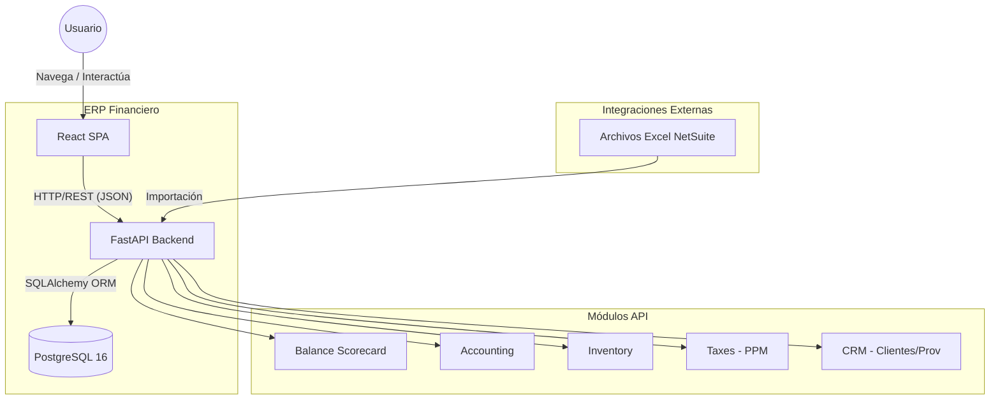

# System Architecture Diagram (C4 Container)

## Containers Description

| Container | Technology | Description |
| :--- | :--- | :--- |
| **React SPA** | React 18, TypeScript, Tailwind | Single Page Application providing the UI for all modules. |
| **FastAPI Backend** | Python 3.12, FastAPI | REST API handling business logic and data persistence. |
| **PostgreSQL 16** | PostgreSQL | Relational database with schemas for each module. |
| **Zustand** | JavaScript | Client-side state management. |
| **SQLAlchemy** | Python | ORM for database communication. |
