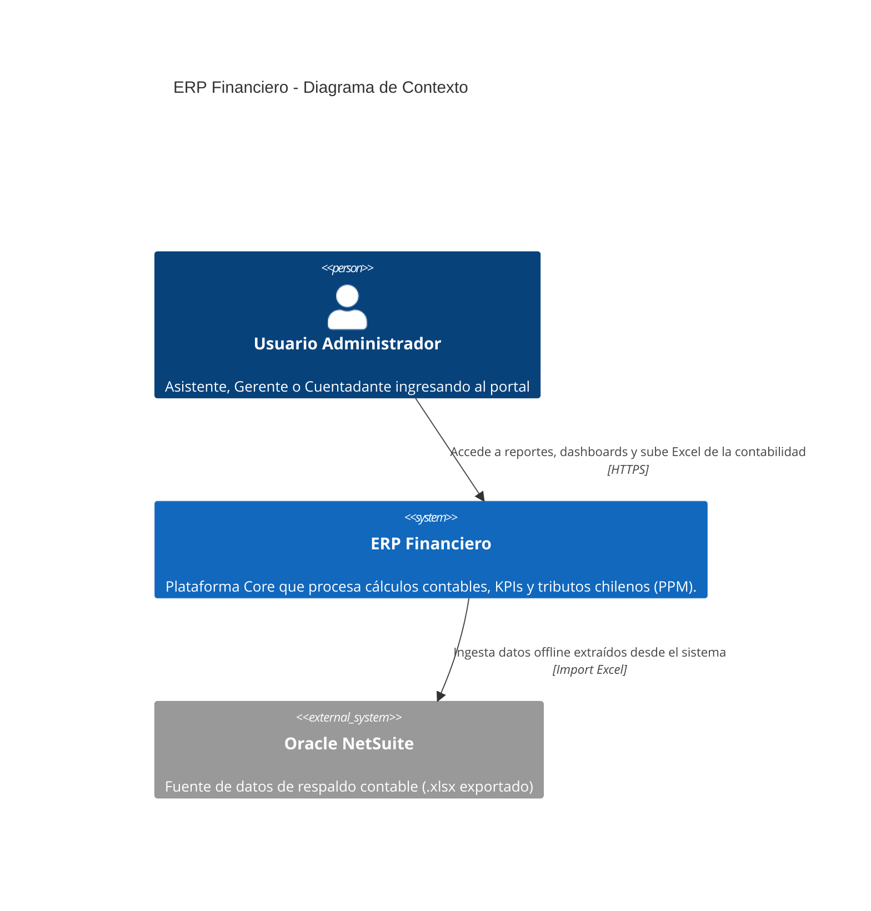
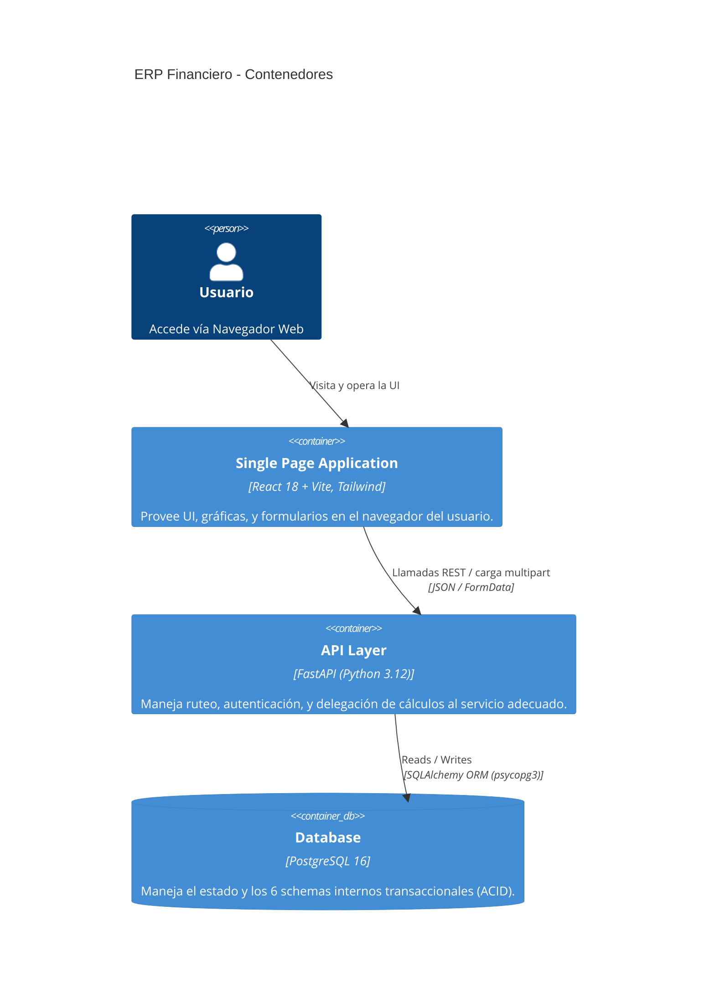
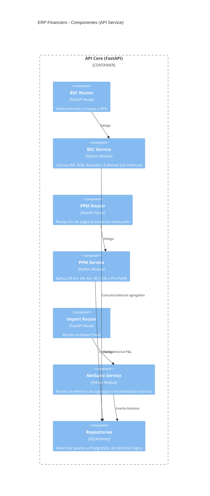

# Arquitectura del Sistema - ERP Financiero

Este documento detalla la estructura principal del ERP Financiero, usando el modelo C4 (Contexto, Contenedores, Componentes).

## Nivel 1: Contexto (System Context Diagram)

## Nivel 2: Contenedores (Container Diagram)

## Nivel 3: Componentes del Backend (Component Diagram)

## Patrón de Separación de Capas (Backend)

La API sigue un diseño CQA (Command Query Architecture) con Inyección Estructural Modular:
1. **Routers (`app/api/`):** Solo procesan validación Pydantic, llaman al servicio y devuelven HTTP status/payload.
2. **Servicios (`app/services/`):** Tienen reglas del negocio puras. Sin noción del cliente HTTP (pueden ser consumidas de terminal o tests unitarios). 
3. **Repositorios (`app/repositories/`):** Capa de acceso a datos que maneja transacciones de BD. (Actualmente los servicios pueden llamar ORM directamente debido a la escala inicial, pero es el siguiente refactor natural listado en deuda técnica).
